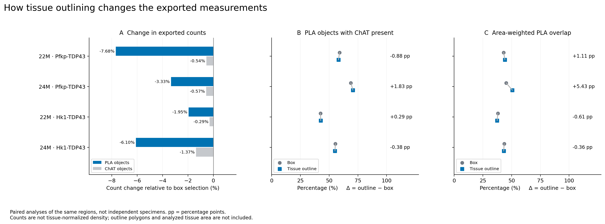
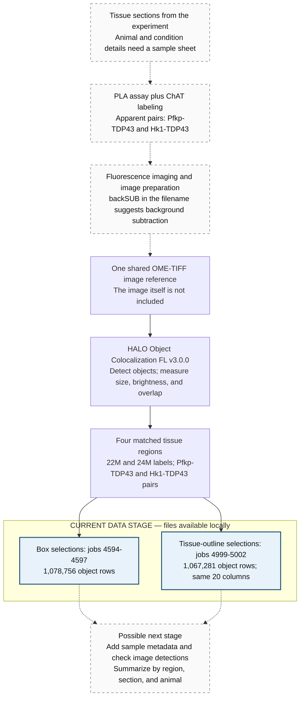

# PLA–ChAT image analysis data

This repository contains object measurements exported from **HALO fluorescence image analysis**. The primary expanded dataset contains **12 completed region/assay analyses and 3,010,776 objects**: **310,024 PLA** and **2,700,752 ChAT** detections. The files reference three source images and six literal labels, each represented by Hk1–TDP43 and Pfkp–TDP43 analyses. Sample identities, running groups, and anatomical correspondence are not defined by those labels alone.

`Initial Data/` preserves eight original box/outline exports. `entire Chat dataset/` contains thirteen exports: four identical copies of the original outlines, eight additional completed analyses, and interrupted job **4978**, superseded by **5403**. Every one of the interrupted export's **94,409 measurement signatures** occurs in the replacement's **190,915 rows**. Copies and the interrupted run are excluded from the primary summaries and retained in the audit.

**The data is at the image-analysis export stage.** Tissue has been imaged, objects have been detected, and their measurements have been exported to tables. The available files contain individual object measurements; sample metadata, source images, analysis settings, and biological conclusions are not included.

## Run the visual analysis

Open [PLA_ChAT_scientific_analysis.ipynb](PLA_ChAT_scientific_analysis.ipynb) in Jupyter or VS Code for the current end-to-end workflow: measurement audit, box-versus-outline comparison, denominator-aware summaries, spatial reconstructions, quality checks, literature framing, actionable findings, and next-step guidance. The earlier [PLA_ChAT_visual_analysis.ipynb](PLA_ChAT_visual_analysis.ipynb) remains available as the original exploratory notebook. Select the project's `.venv` Python kernel and choose **Run All** to recompute the scientific notebook; install the packages in [requirements.txt](requirements.txt) in your selected kernel's environment if needed (`python -m pip install -r requirements.txt`).

The scientific notebook audits all thirteen expanded exports, analyzes twelve primary exports, and retains the original box/outline comparison from `Initial Data/`. It includes paired PLA-type summaries, explicit averaging denominators, maps of every section, distribution and sensitivity figures, and coordinates for image review. The interactive explorer varies the selected section and map resolution. The earlier visual notebook uses `Initial Data/` and keeps its `ROI_MODE` selector.

The scientific notebook uses 50-coordinate-unit bins for detailed count reconstructions; supported fraction maps use 1,000-unit bins with at least 10 raw PLA objects. These are editable display choices. Both types of image use bounding-box midpoints, not recovered microscopy pixels.

The scientific notebook writes its figures, supporting tables, Excel workbook, and provenance under `outputs/scientific_notebook/`. Saved PNG figures use a 300 DPI export setting; PDFs retain vector text and linework. The earlier analysis artifacts remain under `outputs/outline/`, `outputs/roi_comparison/`, and the original root `outputs/` files. The notebook also exports lossless fine-grid arrays. For running-group summaries, complete [metadata/complete_sample_metadata.tsv](metadata/complete_sample_metadata.tsv); the notebook validates those assignments and averages sections within animals before summarizing groups. Whole-section summaries can precede registration, while anatomical spatial comparisons require validated correspondence. The full cited alignment strategy is in the notebook.

## Original box and tissue-outline comparison

The dataset owner identifies these as reruns with a tissue outline replacing the rectangular selection. The `_tight` region names and common image reference support the following explicit pairing. The CSVs themselves do not contain the outline polygon, a tissue mask, or analyzed tissue area.[^9]

| Original box job | New outline job | Exact outline region | All objects | PLA objects | ChAT objects |
| --- | --- | --- | ---: | ---: | ---: |
| 4594 | [Job 4999][csv4999] | `22M_TDP43-Pfkp_tight` | 184,684 | 8,412 | 176,272 |
| 4595 | [Job 5000][csv5000] | `24M_TDP43-Pfkp_tight` | 295,677 | 7,733 | 287,944 |
| 4596 | [Job 5001][csv5001] | `22M_TDP43-Hk1_tight` | 237,144 | 14,984 | 222,160 |
| 4597 | [Job 5002][csv5002] | `24M_TDP43-Hk1_tight` | 349,776 | 41,237 | 308,539 |
| **Total** | **4 outline exports** | | **1,067,281** | **72,366** | **994,915** |

The outline selections have 3,945 fewer PLA objects and 7,530 fewer ChAT objects overall. PLA objects with ChAT present change from **59.04%→58.17%**, **68.91%→70.74%**, **42.44%→42.73%**, and **55.46%→55.07%**, in the pairing order above. These are descriptive changes in the reanalysis, not biological effects. Object IDs restart in every job; the notebook does not join the two runs on `Object Id`.



## Understanding the experiment

A useful way to picture this dataset is a tissue image with two kinds of fluorescent signal. One marks small PLA spots, and the other marks ChAT-positive structures. HALO identifies shapes in these signals and records a row of measurements for each detected shape. A detected shape is called an **object**; segmentation is the process of deciding which part of the image belongs to that object.

The region names suggest that the experiment examines PLA signal for **Pfkp–TDP43** and **Hk1–TDP43**, alongside a ChAT marker, under the labels **22M** and **24M**. This is an interpretation of the exported names, rather than a documented study hypothesis. The abstract does not identify the species, anatomical tissue, treatment, controls, or meaning of `22M` and `24M`. Keep these as literal labels until a sample sheet defines them; they do not establish age, sex, or animal identity.[^1][^2]

| Term in the data | Plain-language meaning |
| --- | --- |
| **PLA** | Proximity ligation assay. In a typical PLA, antibody probes recognizing nearby targets generate an amplified fluorescent signal, seen as a spot or **punctum**. This explains the assay concept; the repository does not identify the kit or protocol used.[^3] |
| **Pfkp / PFKP** | Phosphofructokinase, platelet. Here, `Pfkp-TDP43 PLA` is the label for one apparent PLA target pair.[^4] |
| **Hk1 / HK1** | Hexokinase 1. Here, `Hk1-TDP43 PLA` is the label for the other apparent PLA target pair.[^5] |
| **TDP43 / TDP-43** | A protein also known by the gene name `TARDBP`; it is the shared target named in both pairs.[^6] |
| **ChAT** | Choline acetyltransferase, an enzyme involved in making acetylcholine and commonly associated with cholinergic neurons. In these exports, its object label is exactly `ChAt-50 - FITC_E1`.[^7] |
| **TRITC / FITC** | The fluorescence-channel labels associated with PLA and ChAT, respectively, in these exports. Exact dyes, acquisition settings, and the meaning of `E1` or `50` are not documented. |
| **Colocalization** | Spatial overlap between the detected signals in the analyzed image. These tables report overlap area, overlap percentage, and marker-presence flags. |
| **HALO** | Indica Labs' image-analysis software. Its Object Colocalization FL module supports measuring fluorescent objects and their colocalization.[^8] |

The biological references explain terminology only; they do not identify the species or experimental protocol of this dataset. Also distinguish **PLA target proximity** from **PLA–ChAT image overlap**: the first is the assay's biological readout, while the second locates that readout relative to another marker. The CSVs alone do not establish direct protein binding or assign a punctum to a particular cell.

## How the experiment becomes these CSVs

The diagram traces the experiment to the current data stage. **Dashed arrows identify inferred preparation steps or proposed future work.** Solid arrows connect the image reference, analysis, and exports recorded in the CSVs. It is a description of data provenance; an executable ETL pipeline is not included.



In words: **tissue → labeling → imaging and preparation → HALO object measurements → box and outline CSV exports → comparison and summaries**.

In ETL terms, the image is the input, HALO transforms image signals into object measurements, and the CSVs are the exported tables ready to load into analysis software. The CSVs and abstract support this overall path, but the precise laboratory procedure and image-preparation sequence are not recorded. In particular, `backSUB` suggests background subtraction without specifying its method, parameters, or execution history.[^1][^2]

## Original box-export inventory

The following table covers **every data row in the original box exports**, excluding the header. All eight files share the 20-column schema and the same `Algorithm Name`: `PLA and ChaT Object Colocalization FL v3.0.0`.[^2]

| CSV export | Exact analysis region | All objects | PLA objects | ChAT objects |
| --- | --- | ---: | ---: | ---: |
| [Job 4594][csv4594] | `22M_Pfkp-TDP43 PLA` | 186,343 | 9,112 | 177,231 |
| [Job 4595][csv4595] | `24M_Pfkp-TDP43 PLA` | 297,584 | 7,999 | 289,585 |
| [Job 4596][csv4596] | `22M_Hk1-TDP43 PLA` | 238,084 | 15,282 | 222,802 |
| [Job 4597][csv4597] | `24M_Hk1-TDP43 PLA` | 356,745 | 43,918 | 312,827 |
| **Total** | **4 regions** | **1,078,756** | **76,311** | **1,002,445** |

Here, a PLA object has `Object Type = PLA - TRITC_E1`; a ChAT object has `Object Type = ChAt-50 - FITC_E1`. Both types occur in every file. A ChAT object is a segmented marker-positive shape, and should not automatically be counted as a whole cell or neuron.

All eight files use this filename pattern, with `{job}` replaced by one of the job numbers in the inventories above:

```text
20260515_173745_2_jqw0p1_Ellie_PLA_05152026_2_backSUB.ome.ome.tiff_job{job}PLA and ChaT Object Colocalization FL v3.0.0_object_results.csv
```

All eight exports reference the **same source image** after normalizing repeated Windows path separators:

```text
H:\20260515_173745_2_jqw0p1_Ellie_PLA_05152026_2\20260515_173745_2_jqw0p1_Ellie_PLA_05152026_2_backSUB.ome.ome.tiff
```

The supported file organization is therefore **one shared image reference → four matched regions × two selection methods**. The exports do not establish how many animals or tissue sections are represented, or whether the original image combines multiple sections. `Image Location` is a path from the original Windows environment, not an image supplied with this checkout. The date-like filename components are provenance labels, not confirmed collection or export dates.

**Availability:** the eight CSVs total approximately **711 MB** (678 MiB). The repository's [.gitignore](.gitignore) excludes `*.csv`, `*.tiff`, and `*.ome`, and these eight CSVs are not tracked by Git. Their links above refer to the local files; a fresh clone will need the data supplied separately.

## What each column means

The names below reproduce the CSV headers exactly. `µm` means micrometers; `µm²` means square micrometers. Descriptions follow the exported names and observed values. Settings-dependent definitions remain explicitly unresolved.[^2]

| Column | Type / units | Meaning |
| --- | --- | --- |
| `Image Location` | Text | Original path to the analyzed image; all eight resolve to the same image after normalizing Windows separators. |
| `Analysis Region` | Text | Named image region, such as `22M_Pfkp-TDP43 PLA`. This is the available experimental grouping label. |
| `Algorithm Name` | Text | Analysis configuration name, including the reported module version. It does not include the thresholds or other settings. |
| `Object Id` | Integer | Object identifier within an export. IDs run from `0` to row count minus one and restart in each file. |
| `Object Type` | Category | Which kind of object the row measures: `PLA - TRITC_E1` or `ChAt-50 - FITC_E1`. |
| `Area in PLA and Chat coloc` | Decimal; unit omitted in header | Area attributed to PLA–ChAT overlap for this object. Its relationship to total area and overlap percentage is consistent with µm². |
| `% Area in PLA and Chat coloc` | Decimal, 0–100% | Percentage of **this object's area** attributed to overlap. It is not the percentage of all objects that colocalize. |
| `Area (µm²)` | Decimal, µm² | Area of the detected object. |
| `Inner Area (µm²)` | Decimal, µm² | HALO-reported inner area. The boundary definition requires the analysis settings. |
| `Outer Area (µm²)` | Decimal, µm² | HALO-reported outer area. The boundary definition requires the analysis settings. |
| `Average Intensity` | Decimal; scale unspecified | Mean signal intensity reported for the object. The export has one intensity value per row, without an explicit channel or normalization definition. |
| `Minimum Diameter (µm)` | Decimal, µm | Minimum object diameter reported by HALO. |
| `Maximum Diameter (µm)` | Decimal, µm | Maximum object diameter reported by HALO. |
| `Median Diameter (µm)` | Decimal, µm | Median object diameter reported by HALO. |
| `PLA - TRITC_E1 present` | Integer flag, 0 or 1 | Whether HALO reports PLA signal associated with this object: `1` = present, `0` = absent under the analysis settings. |
| `ChAt-50 - FITC_E1 present` | Integer flag, 0 or 1 | Whether HALO reports ChAT signal associated with this object: `1` = present, `0` = absent under the analysis settings. |
| `XMin` | Integer; coordinate unit unspecified | Lower X bound of the object's image bounding box. |
| `XMax` | Integer; coordinate unit unspecified | Upper X bound of the object's image bounding box. |
| `YMin` | Integer; coordinate unit unspecified | Lower Y bound of the object's image bounding box. |
| `YMax` | Integer; coordinate unit unspecified | Upper Y bound of the object's image bounding box. |

The coordinate fields are bounds, rather than a measured center point or a full object outline. Their integer values suggest image/pixel coordinates, but the units, origin, and resolution must be confirmed from the image metadata. Object area in µm² cannot be replaced by bounding-box area. The exports also contain no Z coordinate, parent-cell identifier, or list of matched PLA–ChAT object pairs.

For every row, the reported overlap percentage agrees with this relationship to within **0.001 percentage points**:

```text
% Area in PLA and Chat coloc
    ≈ 100 × Area in PLA and Chat coloc / Area (µm²)
```

### A real row, translated

In [job 4595][csv4595], `Object Id = 3` has these values:

| Field | Value |
| --- | --- |
| `Analysis Region` | `24M_Pfkp-TDP43 PLA` |
| `Object Type` | `PLA - TRITC_E1` |
| `Area (µm²)` | `0.072128` |
| `Area in PLA and Chat coloc` | `0.068992` |
| `% Area in PLA and Chat coloc` | `95.652176` |
| `PLA - TRITC_E1 present` | `1` |
| `ChAt-50 - FITC_E1 present` | `1` |

In plain English: **HALO detected a PLA object in the region labeled `24M_Pfkp-TDP43 PLA`. It covers about 0.072 µm², and approximately 95.65% of its area overlaps ChAT signal under the analysis settings.** This describes one detected object, rather than a whole cell or a region-wide percentage.[^2]

## Counting PLA and colocalization correctly

Start with **`Object Type`** to choose what is being counted. Filtering only on `PLA - TRITC_E1 present = 1` includes both PLA objects and ChAT objects with associated PLA signal. For example, job 4594 has **9,112 PLA-type objects**, but **12,417 rows with the PLA-present flag** because 3,305 ChAT-type objects also have that flag.[^2]

To calculate the fraction of PLA objects associated with ChAT:

```text
denominator = rows where Object Type is "PLA - TRITC_E1"
numerator   = those same rows where ChAt-50 - FITC_E1 present is 1
percentage  = 100 × numerator / denominator
```

| Export | PLA objects with ChAT present | All PLA objects | Percentage of PLA objects with ChAT present |
| --- | ---: | ---: | ---: |
| Job 4594 | 5,380 | 9,112 | 59.04% |
| Job 4595 | 5,512 | 7,999 | 68.91% |
| Job 4596 | 6,485 | 15,282 | 42.44% |
| Job 4597 | 24,355 | 43,918 | 55.46% |

These are descriptive counts from the exports, without additional filtering. They are **object fractions**, distinct from each row's **area-overlap percentage**. They do not establish a treatment or age effect. Region size, detection settings, specimen identity, and biological replication are not available for a controlled comparison.

The two object types describe overlap from different perspectives. A ChAT object can overlap multiple PLA objects, and the CSVs do not supply explicit object-to-object matches. Adding the counts or overlap areas of both types can count related signal more than once; keep the object type explicit in summaries.

## Reading the files

The exports are comma-delimited, with quoted fields, a **UTF-8 byte-order mark (BOM)**, and Windows-style line endings. Read with `utf-8-sig` so the BOM does not become part of `Image Location`. Preserve the exact header spelling, including `µ`, spaces, and the different capitalizations of ChAT.

This Python example uses only the standard library, reads one row at a time, and reproduces the per-file PLA counts and ChAT-associated fractions above. Run it from the repository root to print per-file counts for every supplied CSV. Keep the box and outline jobs separate when interpreting these counts:

```python
from collections import Counter
from pathlib import Path
import csv
import re

files = sorted(Path(".").glob("*job*PLA and ChaT*object_results.csv"))
if not files:
    raise FileNotFoundError("Place the HALO CSV exports in the repository root.")

for path in files:
    counts = Counter()
    regions = set()
    with path.open(encoding="utf-8-sig", newline="") as handle:
        for row in csv.DictReader(handle):
            regions.add(row["Analysis Region"])
            counts["all_objects"] += 1
            if row["Object Type"] == "PLA - TRITC_E1":
                counts["pla_objects"] += 1
                if row["ChAt-50 - FITC_E1 present"] == "1":
                    counts["pla_with_chat"] += 1

    job = re.search(r"job(\d+)", path.name).group(1)
    fraction = (
        f"{100 * counts['pla_with_chat'] / counts['pla_objects']:.2f}%"
        if counts["pla_objects"] else "undefined (no PLA objects)"
    )
    print(f"Job {job} | {', '.join(sorted(regions))} | "
          f"{counts['all_objects']:,} objects | "
          f"{counts['pla_objects']:,} PLA | "
          f"{counts['pla_with_chat']:,} PLA with ChAT | {fraction}")
```

When combining files into a table, retain a `source_file` column. Use **`source_file` + `Object Id`** as the object key, since IDs repeat across exports. Keep `Analysis Region`, `Object Type`, and both presence flags alongside the measurements.

## Data checks and context needed for analysis

The complete local exports have matching headers, 20 fields per record, no empty fields or invalid numeric values, and no duplicate object IDs within a file. Areas are positive, overlap percentages lie between 0 and 100, and both presence flags equal `1` exactly when overlap area is positive. These are structural consistency checks; they do not verify the accuracy of the image detections.[^2]

Some objects have zero reported diameters or equal minimum and maximum coordinates despite positive area. Inner area is usually zero, but is not zero for every object. These values are present in the source exports: retain them until image review and the HALO settings establish an appropriate filtering rule. The intensity scale is also unspecified, so intensity values should not be treated as calibrated concentrations.

The following information would connect these object tables to biological interpretation:

| Missing context | Why it matters |
| --- | --- |
| A sample sheet mapping each region/job to animal, section, species, tissue, condition, and replicate | Defines `22M` and `24M`, identifies the experimental units, and shows which measurements belong together. |
| Staining/PLA protocol, antibodies, and positive and negative controls | Establishes what the signals represent and how background or nonspecific signal was assessed. |
| Original and processed images, acquisition metadata, and preparation history | Enables visual review and confirms coordinate calibration and the meaning of `backSUB`. |
| HALO configuration, thresholds, size filters, and colocalization rules | Explains how objects, presence flags, inner/outer areas, and intensities were generated. |
| Region outlines and analyzed tissue area | Supplies a denominator for object density; summing detected object areas does not give analyzed tissue area. |
| Cell segmentation and object-to-cell assignments, if per-cell results are needed | Allows puncta per cell to be measured; ChAT-object counts alone do not supply validated cell counts. |

With this context, the next stage would be to review detections against images, define quality filters, and summarize by region and tissue section while retaining animal identity. Biological comparisons need the actual independent experimental units: the million object rows are not a million independent animals or samples.

## Sources

The abstract and local exports in both data folders are the primary evidence for this dataset. The detailed tables below describe the original box/outline subset; the expanded twelve-analysis results and current literature review are in the scientific notebook. Box/outline pairing additionally uses the dataset owner’s description of the rerun. External sources below provide assay, software, and protein terminology only. Web references were accessed on September 13, 2026.

[^1]: Repository author unspecified. [abstract.txt](abstract.txt), two-paragraph dataset description, undated. Source for the intended object-level organization and tissue/animal/condition context.
[^2]: Local HALO object-results exports, jobs [4594][csv4594], [4595][csv4595], [4596][csv4596], and [4597][csv4597], all reporting `PLA and ChaT Object Colocalization FL v3.0.0`; export dates unconfirmed. Source for column names, region/image references, complete-file counts, consistency checks, and example values. The full filenames are defined above; these files are present locally and excluded from Git.
[^3]: Merck / Sigma-Aldrich. [Duolink® Proximity Ligation Assay](https://www.sigmaaldrich.com/US/en/products/protein-biology/duolink-proximity-ligation-assay), undated. General PLA mechanism; this does not establish use of Duolink in this experiment.
[^4]: NCBI Gene. [PFKP — phosphofructokinase, platelet](https://www.ncbi.nlm.nih.gov/gene/5214), Gene ID 5214. Reference for the protein name only.
[^5]: NCBI Gene. [HK1 — hexokinase 1](https://www.ncbi.nlm.nih.gov/gene/3098), Gene ID 3098. Reference for the protein name only.
[^6]: NCBI Gene. [TARDBP — TAR DNA binding protein](https://www.ncbi.nlm.nih.gov/gene/23435), Gene ID 23435. Reference for the TDP-43 alias.
[^7]: NCBI Gene. [CHAT — choline O-acetyltransferase](https://www.ncbi.nlm.nih.gov/gene/1103), Gene ID 1103. Reference for ChAT's function and association with cholinergic neurons.
[^8]: Indica Labs. [Object Colocalization FL Module](https://indicalab.com/halo/halo-modules/object-colocalization-fl/), undated. Public overview of object measurement and colocalization. The [v3.0 user-guide page](https://learn.indicalab.com/courses/halo-modules/lessons/object-colocalization-fl-module/topic/user-guide-object-colocalization-fl-v3/) requires login; its detailed measurement definitions are not used here.

[csv4594]: Initial%20Data/20260515_173745_2_jqw0p1_Ellie_PLA_05152026_2_backSUB.ome.ome.tiff_job4594PLA%20and%20ChaT%20Object%20Colocalization%20FL%20v3.0.0_object_results.csv
[csv4595]: Initial%20Data/20260515_173745_2_jqw0p1_Ellie_PLA_05152026_2_backSUB.ome.ome.tiff_job4595PLA%20and%20ChaT%20Object%20Colocalization%20FL%20v3.0.0_object_results.csv
[csv4596]: Initial%20Data/20260515_173745_2_jqw0p1_Ellie_PLA_05152026_2_backSUB.ome.ome.tiff_job4596PLA%20and%20ChaT%20Object%20Colocalization%20FL%20v3.0.0_object_results.csv
[csv4597]: Initial%20Data/20260515_173745_2_jqw0p1_Ellie_PLA_05152026_2_backSUB.ome.ome.tiff_job4597PLA%20and%20ChaT%20Object%20Colocalization%20FL%20v3.0.0_object_results.csv

[^9]: Dataset owner, September 14, 2026: jobs 4999–5002 use an outline around the same tissue sections previously analyzed with a box. Local exports: [4999][csv4999], [5000][csv5000], [5001][csv5001], [5002][csv5002]. See [tissue-outline review](docs/tissue_outline_review.md) for complete-file checks and comparison methods.

[csv4999]: Initial%20Data/20260515_173745_2_jqw0p1_Ellie_PLA_05152026_2_backSUB.ome.ome.tiff_job4999PLA%20and%20ChaT%20Object%20Colocalization%20FL%20v3.0.0_object_results.csv

[csv5000]: Initial%20Data/20260515_173745_2_jqw0p1_Ellie_PLA_05152026_2_backSUB.ome.ome.tiff_job5000PLA%20and%20ChaT%20Object%20Colocalization%20FL%20v3.0.0_object_results.csv

[csv5001]: Initial%20Data/20260515_173745_2_jqw0p1_Ellie_PLA_05152026_2_backSUB.ome.ome.tiff_job5001PLA%20and%20ChaT%20Object%20Colocalization%20FL%20v3.0.0_object_results.csv

[csv5002]: Initial%20Data/20260515_173745_2_jqw0p1_Ellie_PLA_05152026_2_backSUB.ome.ome.tiff_job5002PLA%20and%20ChaT%20Object%20Colocalization%20FL%20v3.0.0_object_results.csv
